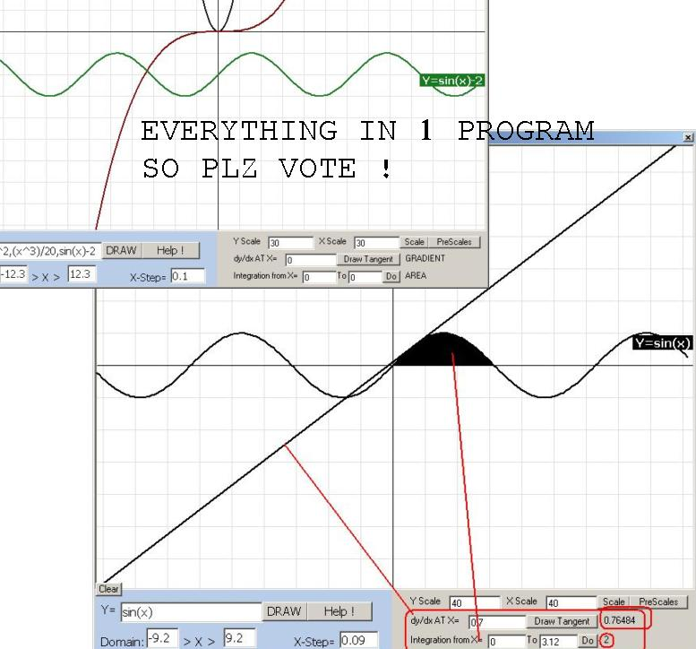



## Math Graph Equation Draw/Plot

### Description

Graph Equation draw : The first and the best program that draws simultaneous equations in

VB.

It labels each equation and gives it a different color.

It can draw straight line, quadratic, sin, cos and tan equations.

You can change the domain and accuracy step.

It can also simulate projectile motion.

You must change your resolution to 1024*768 before running it, though.

It also supports dy/dx [diffrentiaion] and area under curve [integration]

Plz Vote Or Comment If U Liked The Code !
 
### More Info
 
the resolution must be 1024*768

             |
---                |---
**Submitted On**   |2003-11-05 06:38:54
**By**             |[sami haija](https://github.com/Planet-Source-Code/PSCIndex/blob/master/ByAuthor/sami-haija.md)
**Level**          |Advanced
**User Rating**    |4.9 (137 globes from 28 users)
**Compatibility**  |VB 3\.0, VB 4\.0 \(16\-bit\), VB 4\.0 \(32\-bit\), VB 5\.0, VB 6\.0
**Category**       |[Math/ Dates](https://github.com/Planet-Source-Code/PSCIndex/blob/master/ByCategory/math-dates__1-37.md)
**World**          |[Visual Basic](https://github.com/Planet-Source-Code/PSCIndex/blob/master/ByWorld/visual-basic.md)
**Archive File**   |[Math\_Graph1668371162003\.zip](https://github.com/Planet-Source-Code/sami-haija-math-graph-equation-draw-plot__1-49592/archive/master.zip)

